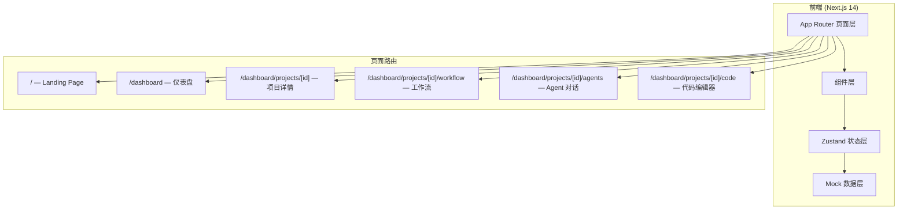

# DeepAgent 前端 Demo — 技术架构文档

## 1. 架构设计



## 2. 技术说明

- **前端框架**：Next.js 14 (App Router) + TypeScript 5.x
- **样式方案**：TailwindCSS 3.4 + CSS Variables 主题
- **状态管理**：Zustand 4.5 (5 个 Store)
- **工作流编辑**：ReactFlow 11.x
- **代码编辑器**：Monaco Editor (@monaco-editor/react)
- **图表**：Recharts 2.x
- **图标**：lucide-react
- **动画**：Framer Motion
- **后端**：无 (纯 Mock 数据)
- **数据**：前端 Mock 数据，模拟 API 响应和 WebSocket 推送

## 3. 路由定义

| 路由 | 用途 | 关键组件 |
|------|------|----------|
| `/` | Landing Page — 品牌展示 | Hero, FeatureCards, ArchitectureDiagram, AgentShowcase |
| `/dashboard` | 仪表盘 — 项目列表+统计 | StatsCards, ProjectGrid, ActivityFeed |
| `/dashboard/projects/[id]` | 项目详情 — Tab 容器 | ProjectHeader, TabNav |
| `/dashboard/projects/[id]/workflow` | 工作流编辑器 | WorkflowEditor, AgentNode, CustomEdge, Toolbar |
| `/dashboard/projects/[id]/agents` | Agent 对话 | ChatPanel, MessageBubble, ThinkingChain, AgentSelector |
| `/dashboard/projects/[id]/code` | 代码编辑器 | CodeEditor, FileTree, CodeDiff, Terminal |

## 4. 数据模型

### 4.1 核心类型定义

```typescript
// Agent 类型
type AgentType = 'coder' | 'reviewer' | 'tester' | 'deployer';
type AgentStatus = 'idle' | 'thinking' | 'working' | 'done' | 'error';

interface Agent {
  id: string;
  type: AgentType;
  name: string;
  status: AgentStatus;
  description: string;
  avatar: string;
}

// 项目
interface Project {
  id: string;
  name: string;
  description: string;
  createdAt: string;
  updatedAt: string;
  agents: Agent[];
  stats: { files: number; lines: number; tests: number; coverage: number };
}

// 对话消息
interface ChatMessage {
  id: string;
  agentId: string;
  role: 'user' | 'agent';
  content: string;
  thinking?: string[];  // Chain of Thought
  timestamp: string;
  codeBlock?: { language: string; code: string };
}

// 工作流节点
interface WorkflowNode {
  id: string;
  type: 'agent' | 'condition' | 'start' | 'end';
  position: { x: number; y: number };
  data: { agent?: Agent; label: string };
}

// 文件树
interface FileNode {
  name: string;
  type: 'file' | 'directory';
  children?: FileNode[];
  language?: string;
  content?: string;
}
```

### 4.2 Mock 数据

Demo 使用硬编码的 Mock 数据，位于 `src/lib/mock-data.ts`：
- 3 个示例项目
- 4 个 Agent 配置
- 预设对话历史（含思考链）
- 预设工作流 DAG
- 示例代码文件树 + 代码内容

## 5. 状态管理

| Store | 状态 | 用途 |
|-------|------|------|
| `auth-store` | `isAuthenticated`, `user` | 演示模式默认已登录 |
| `project-store` | `projects`, `currentProject` | 项目列表和当前选中项目 |
| `agent-store` | `agents`, `messages`, `selectedAgent` | Agent 状态和对话消息 |
| `workflow-store` | `nodes`, `edges`, `isRunning` | 工作流 DAG 状态 |
| `editor-store` | `files`, `currentFile`, `diffMode` | 代码编辑器状态 |

## 6. 关键交互实现

### 6.1 Agent 流式输出模拟

```typescript
// 使用 setTimeout 逐字输出，模拟 LLM 流式响应
async function simulateStreaming(text: string, onChunk: (chunk: string) => void) {
  for (let i = 0; i < text.length; i++) {
    await new Promise(resolve => setTimeout(resolve, 20));
    onChunk(text.slice(0, i + 1));
  }
}
```

### 6.2 工作流运行模拟

点击"运行"后，按 DAG 拓扑顺序依次激活 Agent 节点：
1. Start → Coder (thinking → working → done)
2. Coder → Reviewer (thinking → working → done)
3. Reviewer → Tester (thinking → working → done)
4. Tester → Deployer (thinking → working → done)
5. Deployer → End

### 6.3 思考链展示

每个 Agent 消息可展开查看 Chain of Thought：
- 默认折叠，显示"查看思考过程"
- 展开后显示 3-5 步推理步骤
- 每步带序号 + 简短描述
